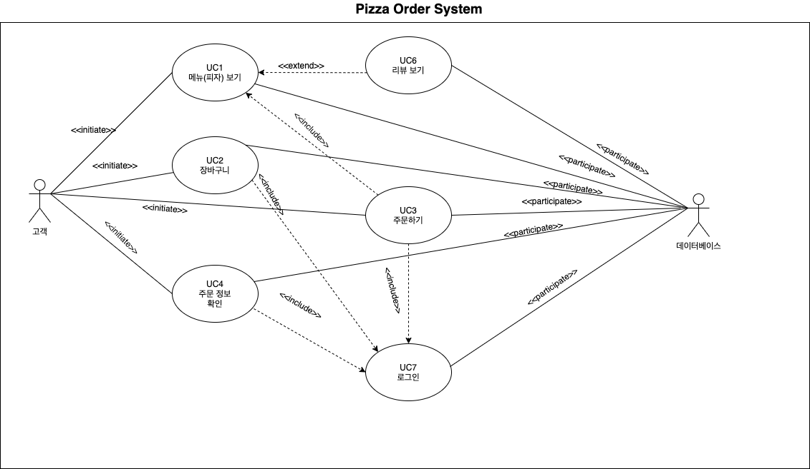
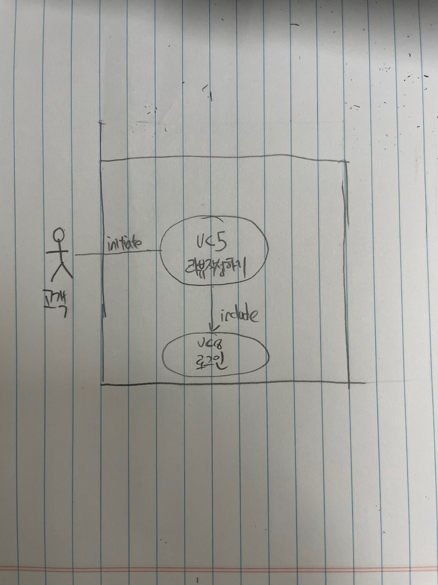

### Deriving Use Cases from System Requirements
|Actor|                                 Actor's Goal                       |         Use Case Name              |
|:---:|:------------------------------------------------------------------:|:----------------------------------:|
| 고객, 데이터베이스 |  피자 메뉴를 볼 수 있으며 선택할 수 있어야 한다.                              |       메뉴(피자) 보기 (Use case 1)    |
| 고객, 데이터베이스 |  장바구니를 보고 선택한 피자 목록을 보고 수정할 수 있어야 한다.                   |      장바구니 (Use case 2)           |
| 고객 |     원하는 피자 메뉴를 주문할 수 있어야 한다.                                |        (Use case 3)          |
| 고객, 데이터베이스 |      주문이 정상적으로 들어갔음과 배달 현황/픽업 시간을 확인할 수 있어야 한다.       |        주문 정보 확인 (Use case 4)    |
| 고객, 데이터베이스 | 주문한 피자에 대해 리뷰를 남길 수 있어야 한다.                                |    리뷰 작성하기 (Use case 5)         |
| 고객, 데이터베이스 |     피자 메뉴에 대한 리뷰를 확인할 수 있어야 한다.                            |    리뷰 보기 (Use case 6)            |
| 고객, 데이터베이스 |     로그인할 수 있어야 한다.                                             |    로그인 (Use case 7)              |

### Use Case Diagram

### Traceability Matrix

|  FR't   |  PW  | UC1  | UC2  | UC3  | UC4  | UC5  | UC6  | UC7  |
| :-----: | :--: | :--: | :--: | :--: | :--: | :--: | :--: | :--: |
|   FR1   |  5   |      |      |      |      |      |      |   X  |
|   FR2   |  5   |   X  |      |   X  |      |      |      |   X  |
|   FR3   |  5   |   X  |      |      |      |      |      |      |
|   FR4   |  2   |   X  |      |      |      |      |  X   |      |
|   FR5   |  4   |   X  |   X  |      |      |      |      |   X  |
|   FR6   |  4   |   X  |   X  |      |      |      |      |   X  |
|   FR7   |  3   |      |      |      |      |      |      |   X  |
|   FR8   |  4   |      |      |      |      |      |      |   X  |
|   FR9   |  3   |   X  |      |   X  |   X  |      |      |   X  |
|   FR10  |  4   |   X  |      |   X  |   X  |      |      |   X  |
|   FR11  |  2   |   X  |      |   X  |      |   X  |      |   X  |
|  Max PW |      |   5  |   4  |   5  |   4  |   2  |   2  |   5  |
| Total PW|      |   29 |   8  |   14 |   7  |   2  |   2  |  34  |

### Schema for Detailed Use Cases
| Use Case UC-1:                            | 메뉴(피자)보기                                      |
| ----------------------------------------- | --------------------------------------------------- |
| Related Requirement:                      | FR2,FR3,FR4,FR5,FR6,FR9,FR10,FR11                                               |
| Initiating Actor:                         | 고객                                            |
| Actor's Goal:                             | 고객은 피자집에서 제공하는 모든 피자 메뉴에 대한 정보를 볼 수 있어야 한다. |
| Participating Actors:                     | 데이터베이스                                                   |
| Preconditions:                            | 서비스에 접속을 해야한다.                         |
| Postconditions:                           | X                                                   |
| Flow of Events for Main Success Scenario: |                                                     |
| →                                         | 1. 고객은 서비스에 접속한다.                 |
| ←                                         | 2. 2.	시스템은 모든 피자 메뉴에 대한 정보를 보여준다.             |

---
| Use Case UC-2:                            | 장바구니                                      |
| ----------------------------------------- | --------------------------------------------------- |
| Related Requirement:                      | FR5, FR6                                                |
| Initiating Actor:                         | 고객                                            |
| Actor's Goal:                             | 장바구니를 보고 선택한 피자 목록을 보고 수정할 수 있어야 한다.  |
| Participating Actors:                     | 데이터베이스                                                   |
| Preconditions:                            | 1. 로그인 되어 있어야 한다.                           |
| Postconditions:                           | X                                                   |
| Flow of Events for Main Success Scenario: |                                                     |
| →                                         | 1. 장바구니를 버튼을 선택한다.                     |
| ←                                         | 2. 고객이 선택한 피자 목록을 보여준다.             |
| Flow of Events for Extensions (Optional Scenario) |                                                     |
| 장바구니 수정하기                  |                                                     |
| →                                        | 3. 선택한 피자에 대해 수량을 수정하거나 원하지 않은 메뉴를 취소를 한다.     |
| ←                                         | 4. 시스템은 데이터 베이스에 반영 후 업데이트가 된 장바구니를 보여준다.            |
| Flow of Events for Extensions (Alternative Scenario) |                                                     |
| 2.a 피자를 선택한 것이 없다면:                  |                                                     |
| →                                        | 1. 시스템은 텅 빈 장바구니를 보여준다.     |

---
| Use Case UC-3:                            | 메뉴                                   |
| ----------------------------------------- | --------------------------------------------------- |
| Related Requirement:                      | FR2, FR9, FR10, FR11                                             |
| Initiating Actor:                         | 고객                                            |
| Actor's Goal:                             | 원하는 피자를 주문할 수 있어야 한다   |
| Participating Actors:                     | X                                                   |
| Preconditions:                            | 1. 로그인 된 상태어야 한다              |
| Postconditions:                           | 1.	주문내역과 결제 내역이 데이터베이스에 업데이트 된다.|
| Flow of Events for Main Success Scenario: |                                                     |
| →                                         | 1. 고객은 피자의 상세페이지에서 장바구니 담기 버튼을 클릭한다.    |
| →                                         | 2. 고객은 피자의 수량과                 |
| →                                         | 3. 선택한 피자에대해 수령방법을 입력한뒤 결제완료를 해야한다. (include UC-7)                |
| →                                         | 3. 고객이 추가 주문요청 사항을 입력한다.           |
| ←                                         | 4. 시스템이 주문을 완료하고 완료되었음을 보여준다.|

---

| Use Case UC-4:                            | 주문 정보 확인                                      |
| ----------------------------------------- | --------------------------------------------------- |
| Related Requirement:                      | FR9, FR10                                                |
| Initiating Actor:                         | 고객                                            |
| Actor's Goal:                             | 주문이 정상적으로 들어갔음과 배달 현황/픽업 시간을 확인할 수 있어야 한다.  |
| Participating Actors:                     | 데이터베이스                                              |
| Preconditions:                            | 1.로그인되어 있어야 한다.|
|                                           | 2.결제가 완료 되어 있어야 한다.|
|                                           | 3.Employee쪽에서 설정한 예상시간 정보를 전달 받아야 한다.              |
| Postconditions:                           | X                                                   |
| Flow of Events for Main Success Scenario: |                                                     |
| →                                         | 1. 주문 정보 확인 버튼을 선택한다.                     |
| ←                                         | 2. 시스템은 Employee쪽 받은 전체 예상시간과 주문 정보와 주문 상태을 보여준다.            |
| Flow of Events for Extensions (Alternative Scenario) |                                                     |
| 2.a 주문한 것이 없다면:                  |                                                     |
| ←                                      | 1.시스템은 빈 주문 정보 화면을 보여준다.     |
---

| Use Case UC-5:                            | 리뷰 작성하기                                      |
| ----------------------------------------- | --------------------------------------------------- |
| Related Requirement:                      | FR11                                             |
| Initiating Actor:                         | 고객                                            |
| Actor's Goal:                             | 고객은 주문한 피자에 대하여 기간과 무관하게 최소 한번은 리뷰를 작성할 수 있어야 한다.|
| Participating Actors:                     | X                                                   |
| Preconditions:                            | 1.로그인상태이어야 한다. 2.고객은 리뷰남길 피자를 반드시 선 결제했어야 한다. |
| Postconditions:                           | X                                                   |
| Flow of Events for Main Success Scenario: |                                                     |
| →                                         | 1.고객은 주문현황 페이지에 들어와서 리스트에서 주문한 피자를 선택한다. |
| ←                                         | 2.시스템이 사용자가 주문했던 피자가 무엇인지 보여주고, 리뷰를 남길 수 있는 칸을 보여준다. |
| →                                         | 3.고객이 리뷰를 남긴다.          |

---
| Use Case UC-6:                            | 리뷰 보기                                      |
| ----------------------------------------- | --------------------------------------------------- |
| Related Requirement:                      | FR4                                                |
| Initiating Actor:                         | 고객                                            |
| Actor's Goal:                             | 피자 메뉴에 대한 리뷰를 확인할 수 있어야 한다.  |
| Participating Actors:                     | X                                                   |
| Preconditions:                            | 1. 로그인 되어 있어야 한다.|
|                                           | 2. 피자 상세페이지에 접속해야 한다.|
| Postconditions:                           | X                                                   |
| Flow of Events for Main Success Scenario: |                                                     |
| →                                         | 1. 리뷰를 보고 싶은 피자를 선택한다.             |
| ←                                         | 2. 해당 피자에 대한 리뷰를 보여준다.            |
| Flow of Events for Extensions (Alternative Scenario) |                                                     |
| 2.a 리뷰가 없다면:                  |                                                     |
| ←                                      | 1.시스템은 빈 리뷰를 보여준다.     |
---

| Use Case UC-7                            | 로그인                                      |
| ----------------------------------------- | --------------------------------------------------- |
| Related Requirement:                      | FR1,FR2,FR5,FR6,FR7,FR8,FR9,FR10,FR11                                              |
| Initiating Actor:                         | 고객                                            |
| Actor's Goal:                             | 회원만 로그인할 수 있어야 한다.  |
| Participating Actors:                     | X                                                   |
| Preconditions:                            |  회원가입이 되어 있어야 한다.                     |
| Postconditions:                           | X                                                   |
| Flow of Events for Main Success Scenario: |                                                     |
| →                                         | 1. 메인페이지에서 로그인 버튼을 선택한다.              |
| ←                                         | 2. 시스템은 로그인 페이지를 보여준다.               |
| →                                         | 3. 로그인 정보를 입력한다.           |
| ←                                         | 2. 시스템은 데이터베이스와 정보와 고객 입력 정보가 일치하는지 확인한다.           |
| ←                                        | 3. 고객은 서비스를 이용할 수 있다.|
| Flow of Events for Extensions (Alternative Scenario) |                                                     |
| 3.a 고객이 회원이 아니라면:                  |                                                     |
| →                                        | 1. 시스템은 로그인 될 때까지 고객으로부터 회원정보를 입력 받는다.     |

