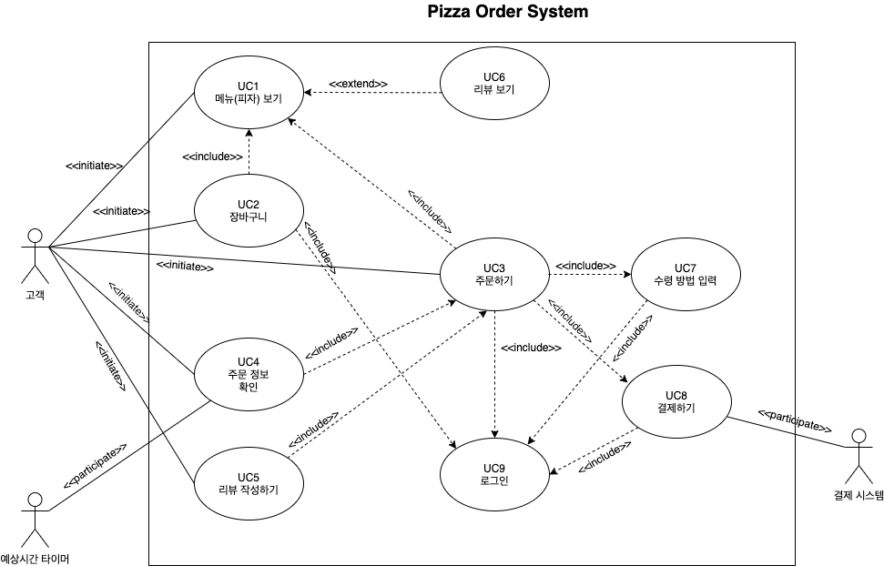

### Deriving Use Cases from System Requirements
|Actor|                                 Actor's Goal                       |         Use Case Name              |
|:---:|:------------------------------------------------------------------:|:----------------------------------:|
| 고객 |  피자 메뉴를 볼 수 있으며 선택할 수 있어야 한다.                              |       메뉴(피자) 보기 (Use case 1)    |
| 고객 |  장바구니를 보고 선택한 피자 목록을 보고 수정할 수 있어야 한다.                   |      장바구니 (Use case 2)           |
| 고객 |     원하는 피자 메뉴를 주문할 수 있어야 한다.                                |       주문하기 (Use case 3)          |
| 고객 |      주문이 정상적으로 들어갔음과 배달 현황/픽업 시간을 확인할 수 있어야 한다.       |        주문 정보 확인 (Use case 4)    |
| 고객 | 주문한 피자에 대해 리뷰를 남길 수 있어야 한다.                                |    리뷰 작성하기 (Use case 5)         |
| 고객 |     피자 메뉴에 대한 리뷰를 확인할 수 있어야 한다.                            |    리뷰 보기 (Use case 6)            |
| 고객 |     배달인지 픽업인지 선택할 수 있어야 한다.                                 |    수령 방법 입력 (Use case 7)        |
| 고객 |     주문한 피자를 결제할 수 있어야 한다.                                    |    결제하기 (Use case 8)             |
| 고객 |     로그인할 수 있어야 한다.                                             |    로그인 (Use case 9)              |

### Use Case Diagram

### Traceability Matrix

|  FR't   |  PW  | UC1  | UC2  | UC3  | UC4  | UC5  | UC6  | UC7  | UC8  | UC9  |
| :-----: | :--: | :--: | :--: | :--: | :--: | :--: | :--: | :--: | :--: | :--: |
|   FR1   |  5   |      |      |      |      |      |      |      |      |   X  |
|   FR2   |  5   |   X  |      |   X  |      |      |      |   X  |   X  |   X  |
|   FR3   |  5   |   X  |      |      |      |      |      |      |      |      |
|   FR4   |  2   |   X  |      |      |      |      |  X   |      |      |      |
|   FR5   |  4   |   X  |   X  |      |      |      |      |      |      |   X  |
|   FR6   |  4   |   X  |   X  |      |      |      |      |      |      |   X  |
|   FR7   |  3   |      |      |      |      |      |      |   X  |      |   X  |
|   FR8   |  4   |      |      |      |      |      |      |      |   X  |   X  |
|   FR9   |  3   |   X  |      |   X  |   X  |      |      |   X  |   X  |   X  |
|   FR10  |  4   |   X  |      |   X  |   X  |      |      |   X  |   X  |   X  |
|   FR11  |  2   |   X  |      |   X  |      |   X  |      |   X  |   X  |   X  |
|  Max PW |      |   5  |   4  |   5  |   4  |   2  |   2  |   5  |   5  |   5  |
| Total PW|      |   29 |   8  |   14 |   7  |   2  |   2  |  17  |  18  |  34  |

### Schema for Detailed Use Cases
