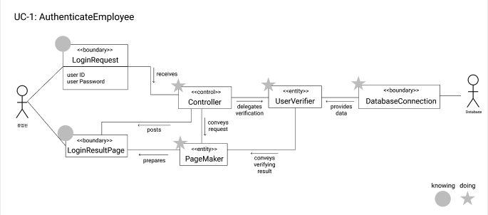
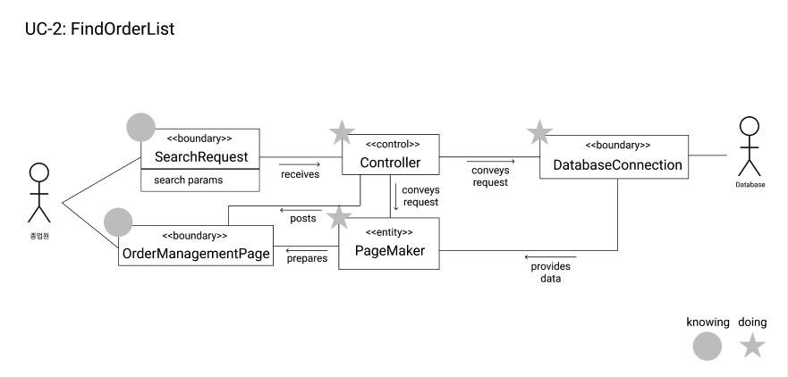
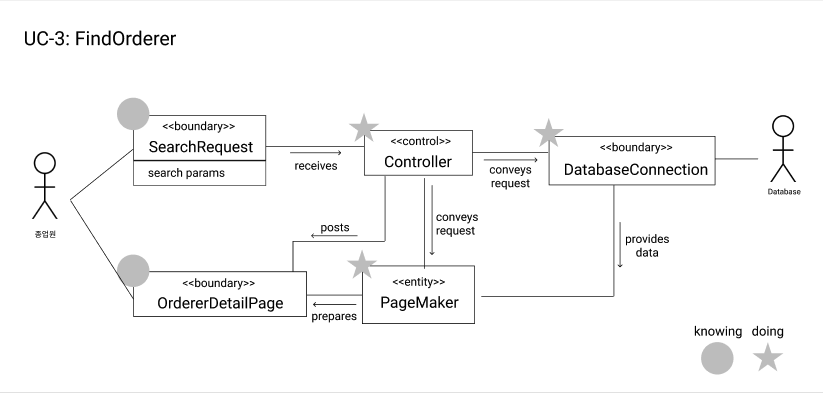
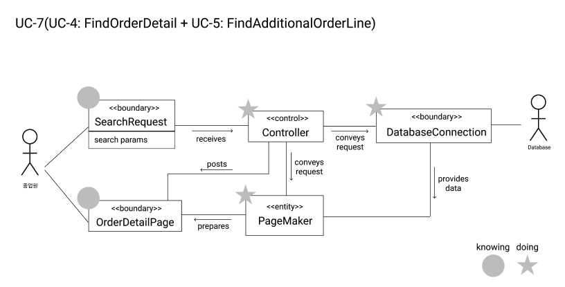
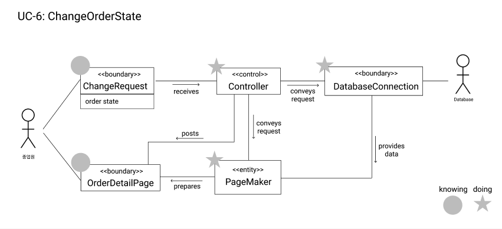

# Domain Model
## UC-1 AuthenticateEmployee
### Extracting the Responsibility

| Responsibility Description                                   | Type | Concept Name       |
| ------------------------------------------------------------ | :--: | ------------------ |
| Use Case와 관련된 모든 컨셉들의 행동을 관리하고, 적절한 컨셉에게 위임한다. |  D   | Controller         |
| 종업원이 입력한 ID, PW를 가지고 있다.                        |  K   | LoginRequest       |
| 유효한 유저인지 검증한다.                                    |  D   | UserVerifier       |
| ID에 해당하는 유저 정보를 반환한다.                          |  D   | DatabaseConnection |
| HTML 문서를 생성한다.                                        |  D   | PageMaker          |
| 로그인 결과를 표시한다.                                      |  K   | LoginResultPage    |

### Extracting the Associations

| Concept Pair                      | Association Description                                      | Association Name         |
| --------------------------------- | ------------------------------------------------------------ | ------------------------ |
| LoginRequest ↔ Controller         | 컨트롤러는 종업원이 입력한 ID와 PW를 전달받는다.             | receives                 |
| Controller ↔ UserVerifier         | 컨트롤러는 UserVerifier에게 검증을 위임한다.                 | delegates verification   |
| DatabaseConnection ↔ UserVerifier | UserVerifier는 DatabaseConnection로부터 유저 정보를 전달받는다. | provides data            |
| Controller ↔ LoginResultPage      | 컨트롤러는 LoginResultPage를 사용자에게 전달한다.            | posts                    |
| Controller ↔ PageMaker            | 컨트롤러는 페이지 생성에 필요한 데이터를 전달한다.           | conveys request          |
| PageMaker ↔ LoginResultPage       | 페이지메이커는 로그인 결과를 반영하여 페이지를 만든다.       | prepares                 |
| UserVerifier ↔ PageMaker          | 페이지메이커에게 검증 결과를 전달한다.                       | conveys verifying result |

### Extracting the Attributes

| Concept      | Attributes  | Attribute Description           |
| ------------ | ----------- | ------------------------------- |
| LoginRequest | 로그인 정보 | 입력한 유저의 아이디와 패스워드 |

---

## UC-2 FindOrderList
### Extracting the Responsibility

| Responsibility Description                                   | Type | Concept Name        |
| ------------------------------------------------------------ | :--: | ------------------- |
| Use Case와 관련된 모든 컨셉들의 행동을 관리하고, 적절한 컨셉에게 위임한다. |  D   | Controller          |
| 조회하고자 하는 주문들의 조건을 전달한다.                    |  K   | SearchRequest       |
| 주문 전체를 보여주는 HTML 문서                               |  K   | OrderManagementPage |
| HTML 문서를 생성한다.                                        |  D   | PageMaker           |
| 데이터베이스 질의문을 통해 해당하는 주문 정보를 반환한다.    |  D   | DatabaseConnection  |

### Extracting the Associations

| Concept Pair                     | Association Description                                      | Association Name |
| -------------------------------- | ------------------------------------------------------------ | ---------------- |
| SearchRequest ↔ Controller       | 컨트롤러는 조회에 필요한 조건들을 전달받는다.                | receives         |
| Controller ↔ DatabaseConnection  | Controller는 DatabaseConnection에게 조건에 해당하는 데이터 조회를 요청한다. | conveys request  |
| Controller ↔ OrderManagementPage | 컨트롤러는 OrderManagementPage를 사용자에게 전달한다.        | posts            |
| Controller ↔ PageMaker           | 컨트롤러는 페이지 생성에 필요한 데이터를 전달한다.           | conveys request  |
| PageMaker ↔ OrderManagementPage  | 페이지메이커는 주문 리스트를 반영하여 페이지를 만든다.       | prepares         |
| DatabaseConnection ↔ PageMaker   | PageMaker는 DatabaseConnection로부터 주문 정보를 전달받는다. | provides data    |

### Extracting the Attributes

| Concept       | Attributes        | Attribute Description                                        |
| ------------- | ----------------- | ------------------------------------------------------------ |
| SearchRequest | search parameters | 주문 상태(배달 완료를 제외한 대기 중, 준비 중, 배달 중)를 가지고 있다. |

---

## UC-3 FindOrderer
### Extracting the Responsibility

| Responsibility Description                                   | Type | Concept Name       |
| ------------------------------------------------------------ | :--: | ------------------ |
| Use Case와 관련된 모든 컨셉들의 행동을 관리하고, 적절한 컨셉에게 위임한다. |  D   | Controller         |
| 조회하고자 하는 주문자의 아이디를 전달한다.                  |  K   | SearchRequest      |
| 주문자의 상세 정보를 보여주는 HTML 문서                      |  K   | OrdererDetailPage  |
| HTML 문서를 생성한다.                                        |  D   | PageMaker          |
| 데이터베이스 질의문을 통해 해당하는 주문자 정보를 반환한다.  |  D   | DatabaseConnection |

### Extracting the Associations

| Concept Pair                    | Association Description                                      | Association Name |
| ------------------------------- | ------------------------------------------------------------ | ---------------- |
| SearchRequest ↔ Controller      | 컨트롤러는 조회에 필요한 조건들을 전달받는다.                | receives         |
| Controller ↔ DatabaseConnection | Controller는 DatabaseConnection에게 조건에 해당하는 데이터 조회를 요청한다. | conveys request  |
| Controller ↔ OrdererDetailPage  | 컨트롤러는 OrdererDetailPage를 사용자에게 전달한다.          | posts            |
| Controller ↔ PageMaker          | 컨트롤러는 페이지 생성에 필요한 데이터를 전달한다.           | conveys request  |
| PageMaker ↔ OrdererDetailPage   | 페이지메이커는 주문자 정보를 담고 있는 페이지를 만든다.      | prepares         |
| DatabaseConnection ↔ PageMaker  | PageMaker는 DatabaseConnection로부터 주문자 정보를 전달받는다. | provides data    |

### Extracting the Attributes

| Concept       | Attributes        | Attribute Description                   |
| ------------- | ----------------- | --------------------------------------- |
| SearchRequest | search parameters | 주문한 유저(주문자)의 ID를 가지고 있다. |

---

## UC-7(UC-4 FindOrderDetail + UC-5 FindAdditionalOrderLine)

### Extracting the Responsibility

| Responsibility Description                                   | Type | Concept Name       |
| ------------------------------------------------------------ | :--: | ------------------ |
| Use Case와 관련된 모든 컨셉들의 행동을 관리하고, 적절한 컨셉에게 위임한다. |  D   | Controller         |
| 조회하고자 하는 주문의 아이디를 전달한다.                    |  K   | SearchRequest      |
| 주문 하나의 상세 정보를 보여주는 HTML 문서                   |  K   | OrderDetailPage    |
| HTML 문서를 생성한다.                                        |  D   | PageMaker          |
| 데이터베이스 질의문을 통해 해당하는 주문 상세 정보를 반환한다. |  D   | DatabaseConnection |

### Extracting the Associations

| Concept Pair                    | Association Description                                      | Association Name |
| ------------------------------- | ------------------------------------------------------------ | ---------------- |
| SearchRequest ↔ Controller      | 컨트롤러는 조회에 필요한 조건들을 전달받는다.                | receives         |
| Controller ↔ DatabaseConnection | Controller는 DatabaseConnection에게 조건에 해당하는 데이터 조회를 요청한다. | conveys request  |
| Controller ↔ OrderDetailPage    | 컨트롤러는 OrderDetailPage를 사용자에게 전달한다.            | posts            |
| Controller ↔ PageMaker          | 컨트롤러는 페이지 생성에 필요한 데이터를 전달한다.           | conveys request  |
| PageMaker ↔ OrderDetailPage     | 페이지메이커는 주문 상세 정보와 추가 요청 사항을 담고 있는 페이지를 만든다. | prepares         |
| DatabaseConnection ↔ PageMaker  | PageMaker는 DatabaseConnection로부터 주문 상세 정보와 추가 요청 사항을 전달받는다. | provides data    |

### Extracting the Attributes

| Concept       | Attributes        | Attribute Description    |
| ------------- | ----------------- | ------------------------ |
| SearchRequest | search parameters | 주문의 ID를 가지고 있다. |

---

## UC-6 ChangeOrderState

### Extracting the Responsibility

| Responsibility Description                                   | Type | Concept Name       |
| ------------------------------------------------------------ | :--: | ------------------ |
| Use Case와 관련된 모든 컨셉들의 행동을 관리하고, 적절한 컨셉에게 위임한다. |  D   | Controller         |
| 변경하고자 하는 주문 상태를 전달한다.                        |  K   | ChangeRequest      |
| 주문 하나의 상세 정보를 보여주는 HTML 문서                   |  K   | OrderDetailPage    |
| HTML 문서를 생성한다.                                        |  D   | PageMaker          |
| 데이터베이스 질의문을 통해 변경하고자 하는 주문 상태를 저장 후 반환한다. |  D   | DatabaseConnection |

### Extracting the Associations

| Concept Pair                    | Association Description                                      | Association Name |
| ------------------------------- | ------------------------------------------------------------ | ---------------- |
| ChangeRequest ↔ Controller      | 컨트롤러는 변경할 주문 상태를 전달받는다.                    | receives         |
| Controller ↔ DatabaseConnection | Controller는 DatabaseConnection에게 주문 상태 변경을 요청한다. | conveys request  |
| Controller ↔ OrderDetailPage    | 컨트롤러는 OrderDetailPage를 사용자에게 전달한다.            | posts            |
| Controller ↔ PageMaker          | 컨트롤러는 페이지 생성에 필요한 데이터를 전달한다.           | conveys request  |
| PageMaker ↔ OrderDetailPage     | 페이지메이커는 변경된 주문 상태를 담고 있는 페이지를 만든다. | prepares         |
| DatabaseConnection ↔ PageMaker  | PageMaker는 DatabaseConnection로부터 변경된 주문 상태를 전달받는다. | provides data    |

### Extracting the Attributes

| Concept       | Attributes  | Attribute Description                    |
| ------------- | ----------- | ---------------------------------------- |
| ChangeRequest | order state | 변경하고자 하는 주문 상태를 가지고 있다. |

