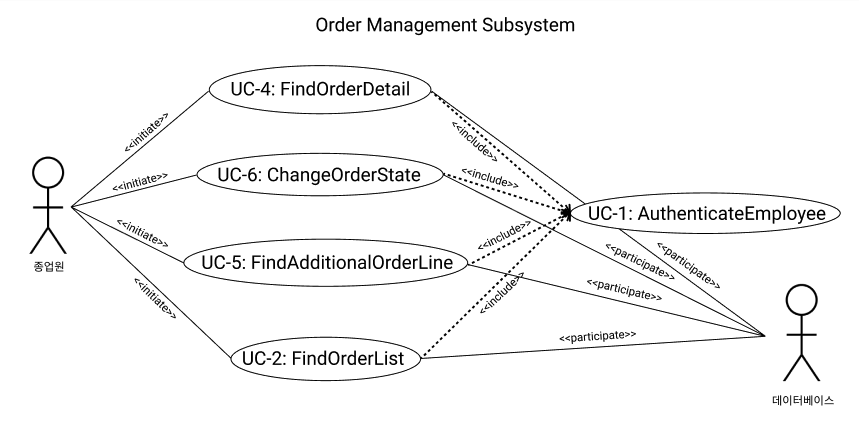

### Deriving Use Cases from System Requirements
|  Actor   |       Actor's Goal       |         Use Case Name         |
|:--------:|:------------------------:|:-----------------------------:|
| Employee, Database |  주문 관리 페이지 접속   |          AuthenticateEmployee(UC-1)          |
| Employee, Database |  주문 정보 리스트 조회   |      FindOrderList(UC-2)      |
| Employee, Customer, Database |     주문자 정보 조회     |       FindOrderer(UC-3)       |
| Employee, Database |      주문 내역 조회      |        FindOrderDetail(UC-4)        |
| Employee, Database | 주문 추가 요청 사항 조회 | FindAdditionalOrderLine(UC-5) |
| Employee, Databasee |      주문 상태 변경      |    ChangeOrderState(UC-6)     |

### Use Case Diagram

---

  

### Traceability Matrix

|  Req't   |  PW  | UC1  | UC2  | UC3  | UC4  | UC5  | UC6  |
| :------: | :--: | :--: | :--: | :--: | :--: | :--: | :--: |
|   REQ1   |  3   |  X   |      |      |      |      |      |
|   REQ2   |  1   |  X   |  X   |      |      |      |      |
|   REQ3   |  2   |  X   |      |  X   |      |  X   |      |
|   REQ4   |  2   |  X   |      |      |  X   |      |      |
|   REQ5   |  4   |  X   |      |      |      |      |  X   |
|  Max PW  |      |  4   |  1   |  2   |  2   |  2   |  4   |
| Total PW |      |  12  |  1   |  2   |  2   |  2   |  4   |

### Schema for Detailed Use Cases

| Use Case UC-1:                           | AuthenticateEmployee |
|------------------------------------------|----------------------|
|Related Requirement:                      |FR1, FR2, FR3, FR4, FR5|
|Initiating Actor:                         | Employee |
|Actor's Goal:                             | - 종업원으로써 사용할 수 있는 기능을 사용하기 위하여, 자신이 종업원 임을 인증한다.|
|Participating Actors:                     |Database|
|Preconditions:                            |- 회원 가입이 되어있어야한다.|
|                                          |- 종업원으로 등록 되어있어야 한다.|
|Postconditions:                           |- 종업원을 주문 관리 페이지로 접속 시킨다.|
|Flow of Events for Main Success Scenario: ||
|←                                         |1. 홈페이지에 접속하면 로그인 창이 뜬다. |
|→                                         |2. 로그인 창에 자신의 아이디와 비밀번호를 입력한다. |
|←                                         |3. 종업원 인증에 성공하고, 주문 관리 권한을 얻는다. |
|Flow of Events for Extensions (Alternate Scenarios): ||
|                                          |2a. 입력한 아이디, 비밀번호와 일치하는 회원이 존재하지 않는다.|
|←                                         |1. 입력한 정보와 일치하는 회원이 없다는 것을 감지하고, 잘못된 정보를 입력했다라는 알림을 표시한다.|
|←                                         |2. 로그인 페이지로 이동한다.|
|                                          |2b. 종업원의 계정이 Employee 권한을 얻지 못했다.|
|←                                        |1. 입력한 정보와 일치하는 회원의 권한이 Employee 혹은 Administrator가 아님을 시스템이 감지하고, 권한이 없는 사용자라는 알림을 표시한다.|
|←                                         |2. 로그인 페이지로 이동한다.|

---

| Use Case UC-2:                            | FindOrderList                                       |
| ----------------------------------------- | --------------------------------------------------- |
| Related Requirement:                      | FR2                                                 |
| Initiating Actor:                         | Employee                                            |
| Actor's Goal:                             | - 주문을 관리하기 위하여 모든 주문 정보를 조회한다. |
| Participating Actors:                     | Database                                            |
| Preconditions:                            | - 직원 로그인이 되어있다.                            |
| Postconditions:                           | X                                                   |
| Flow of Events for Main Success Scenario: |                                                     |
| →                                         | 1. 주문 관리 페이지에 접속한다.                     |
| ←                                         | 2. 모든 주문 정보 리스트를 전달 받는다.             |

---

| Use Case UC-3:                            | FindOrderer                                        |
| ----------------------------------------- | -------------------------------------------------- |
| Related Requirement:                      | FR3                                                |
| Initiating Actor:                         | Employee                                           |
| Actor's Goal:                             | - 배달에 필요한 주문자 정보를 조회한다.            |
| Participating Actors:                     | Customer, Database                                 |
| Preconditions:                            | - 직원 로그인이 되어있다.                          |
|                                           | - 고객이 회원 가입하여 주문자 정보를 등록해야한다. |
|                                           | - 주문이 들어온 상태이다.                      |
| Postconditions:                           | X                                                  |
| Flow of Events for Main Success Scenario: |                                                    |
| →                                         | 1. 주문 정보 리스트에서 주문을 선택한다.           |
| →                                         | 2. 주문 정보 중 주문자 정보 조회를 선택한다.       |
| ←                                         | 3. 고객의 주소와 핸드폰 번호를 전달 받는다.        |

---

| Use Case UC-4:                            | FindOrderDetail                            |
| ----------------------------------------- | ------------------------------------------ |
| Related Requirement:                      | FR4                                        |
| Initiating Actor:                         | Employee                                   |
| Actor's Goal:                             | - 주문 상세 정보를 조회한다.               |
| Participating Actors:                     | Database                                   |
| Preconditions:                            | - 주문이 존재해야 한다.                    |
|                                           | - 직원 로그인이 되어있다.                  |
| Postconditions:                           | X                                          |
| Flow of Events for Main Success Scenario: |                                            |
| →                                         | 1. 주문 정보 리스트에서 주문을 선택한다.   |
| →                                         | 2. 주문 정보 중 주문 상세 조회를 선택한다. |
| ←                                         | 3. 주문의 메뉴와 개수를 전달 받는다.       |

---

| Use Case UC-5:                            | FindAdditionalOrderLine                    |
| ----------------------------------------- | ------------------------------------------ |
| Related Requirement:                      | FR3                                        |
| Initiating Actor:                         | Employee                                   |
| Actor's Goal:                             | - 고객의 추가 요청 사항을 조회한다.        |
| Participating Actors:                     | Database                                   |
| Preconditions:                            | - 주문이 존재해야 한다.                    |
|                                           | - 주문에 추가 요청 사항이 존재해야 한다.   |
|                                           | - 직원 로그인이 되어있다.                  |
| Postconditions:                           | X                                          |
| Flow of Events for Main Success Scenario: |                                            |
| →                                         | 1. 주문 정보 리스트에서 주문을 선택한다.   |
| →                                         | 2. 주문 정보 중 추가 요청 사항을 선택한다. |
| ←                                         | 3. 고객의 추가 요청 사항을 전달 받는다.    |

---

| Use Case UC-6:                            | ChangeOrderState                                             |
| ----------------------------------------- | ------------------------------------------------------------ |
| Related Requirement:                      | FR5                                                          |
| Initiating Actor:                         | Employee                                                     |
| Actor's Goal:                             | - 주문의 상태를 변경한다.                                    |
| Participating Actors:                     | Database                                                     |
| Preconditions:                            | - 주문이 존재해야 한다.                                      |
|                                           | - 직원 로그인이 되어있다.                                    |
| Postconditions:                           | X                                                            |
| Flow of Events for Main Success Scenario: |                                                              |
| →                                         | 1. 주문 정보 리스트에서 주문을 선택한다.                     |
| →                                         | 2. 주문 상태 변경을 선택한다.                                |
| →                                         | 3. 주문 상태를 다음 단계 혹은 이전 단계로 변경한다. (대기 중 ↔ 준비중 ↔ 배달 중 ↔ 배달 완료) |
| →                                         | 4. 변경 완료를 선택한다.                                     |
| ←                                         | 5. 주문 상태가 변경된다.                                     |

