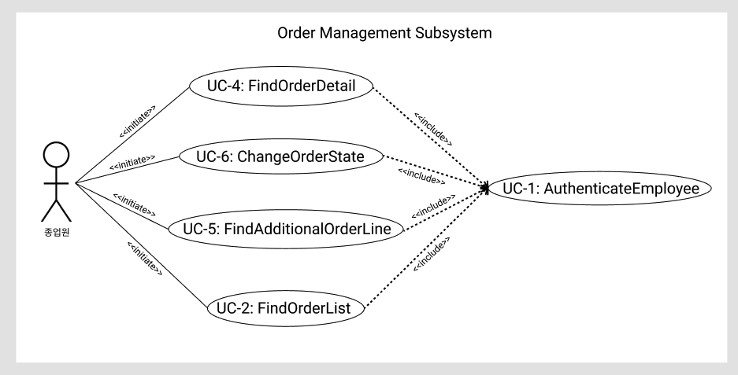
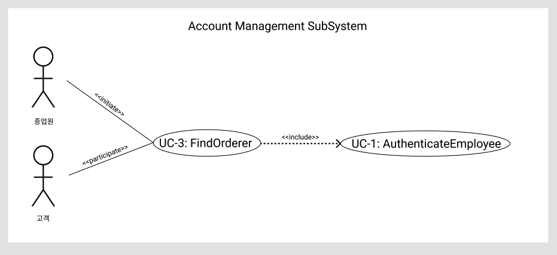

### Deriving Use Cases from System Requirements
|  Actor   |       Actor's Goal       |         Use Case Name         |
|:--------:|:------------------------:|:-----------------------------:|
| Employee |  주문 관리 페이지 접속   |          AuthenticateEmployee(UC-1)          |
| Employee |  주문 정보 리스트 조회   |      FindOrderList(UC-2)      |
| Employee |     주문자 정보 조회     |       FindOrderer(UC-3)       |
| Employee |      주문 내역 조회      |        FindOrderDetail(UC-4)        |
| Employee | 주문 추가 요청 사항 조회 | FindAdditionalOrderLine(UC-5) |
| Employee |      주문 상태 변경      |    ChangeOrderState(UC-6)     |

### Use Case Diagram

---

  

### Traceability Matrix

|  Req't   |  PW  | UC1  | UC2  | UC3  | UC4  | UC5  | UC6  |
| :------: | :--: | :--: | :--: | :--: | :--: | :--: | :--: |
|   REQ1   |  3   |  X   |      |      |      |      |      |
|   REQ2   |  1   |  X   |  X   |      |      |      |      |
|   REQ3   |  2   |  X   |      |  X   |      |  X   |      |
|   REQ4   |  2   |  X   |      |      |  X   |      |      |
|   REQ5   |  4   |  X   |      |      |      |      |  X   |
|  Max PW  |      |  4   |  1   |  2   |  2   |  2   |  4   |
| Total PW |      |  12  |  1   |  2   |  2   |  2   |  4   |

